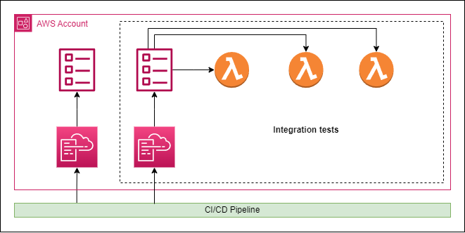

# Welcome to your CDK TypeScript project

This is a blank project for CDK development with TypeScript.

The `cdk.json` file tells the CDK Toolkit how to execute your app.

## Useful commands

* `npm run build`   compile typescript to js
* `npm run watch`   watch for changes and compile
* `npm run test`    perform the jest unit tests
* `cdk deploy`      deploy this stack to your default AWS account/region
* `cdk diff`        compare deployed stack with current state
* `cdk synth`       emits the synthesized CloudFormation template

# Testing your IaC

## Source Code Analysis Tools / Static Application Security Testing

### What does it do?
We can use cfn-lint to lint the synthed CDK stack. This could help us identify problems in our stacks/constructs in relation to the AWS CloudFormation Resource Specification.

As an example you could think of EC2 types or services that might not be available in all regions. Cfn-lint might warn us in case we made mistakes in regards to the specification.

Besides cfn-lint we also have cdk-nag (or cfn-nag) available to make us aware of any security related issues in ou codebase.

### How is it done?
Cfn-lint and cdk-nag (cfn-nag) can be ran in a CI pipeline. Cfn-lint and cfn-nag can also be installed as a plugin for Visual Studio Code.

## Snapshot tests

### What does it do?
Snapshot tests compare the synthed code from a stacks or construct previous run to that of the current run. It will throw an error if the synthed cloudformation templates are not identical.

Snapshot tests can help identify changes made by for example CDK toolkit upgrades. They can also help identify unintentional changes to stacks or constructs while implementing a new feature or while adding infrastructure. They can also validate that code refactoring did not change the output. Or make you aware of changes to context values.

### How is it done?
The file `./test/snapshot.test.ts` contains an example in which a snapshot test is done of a CDK stack.

You can run the tests using the command `npm test`. You can also test a single file using the command `npm test -- -i snapshot.test.ts`, or a single test in a file using `npm test -- -i snapshot.test.ts -t "ExampleStackOne snapshot test"`. In which `-t` refers to a `describe(...)`, `it(...)` or `test(...)` block and `-i` to the file name.

An other method of running a single test would be to alter the test file an use Jests `.only()` method.

Update your snapshot by running the command `npm test -- -u` or a single snapshot using `npm test -- -i snapshot.test.ts -t "ExampleStackOne snapshot test" -u`.

## Fine-grained Assertion tests

### What does it do?
Fine-grained assertion test can help us to stay in compliance with security office requirements, or any other ruleset we need to comply with. The also help is to validate that relationships between resources exist. For example, that a S3 bucket had a policy attached to it.

### How is it done

Examples can be found in the file `./lib/example-stack-one.spec.ts`.

We place files on which we perform assertions next to the file constaining the stack/construct we are performing assertions against. We do this because the assertions check if a certain specification is met. To make these specifications easy to find for a stack/construct, it is best to keep them next to eachother.

The resources mentioned in the fine-grained assertions are CloudFormation mappings of the resources in the CDK code. This is because we are performing the assertions against the synthed CDK code. Consult the CloudFormation [User Guide](https://docs.aws.amazon.com/AWSCloudFormation/latest/UserGuide/Welcome.html) for ressource definitions.

Within our test we can make use of the CDK [assertions module](https://docs.aws.amazon.com/cdk/api/v2/docs/aws-cdk-lib.assertions-readme.html) and Jests [expect](https://jestjs.io/docs/expect) and [mocking](https://jestjs.io/docs/mock-function-api) functionality. 

## Integration tests

### What does it do?

### How is it done

# Next
- Testing Lambda functions.
- Integration tests.
- E2E tests.

# Sources
https://www.youtube.com/watch?v=KJC380Juo2w
https://www.youtube.com/watch?v=qlzX65SdNdQ
https://www.youtube.com/watch?v=DYS-obUX_V0
https://www.youtube.com/watch?v=b6p25GzGsAE
https://www.youtube.com/watch?v=1R7G_wcyd3s
https://docs.aws.amazon.com/cdk/v2/guide/testing.html
